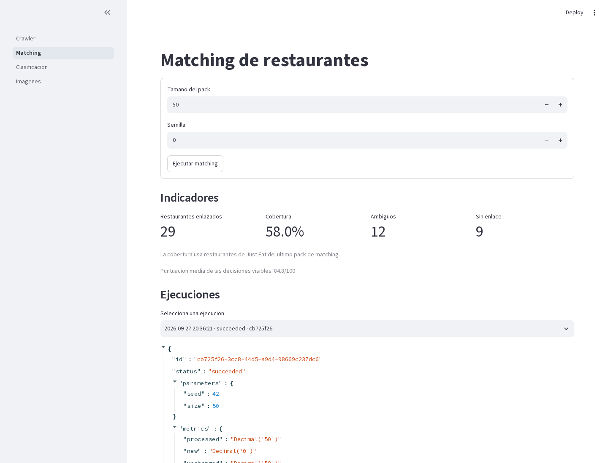
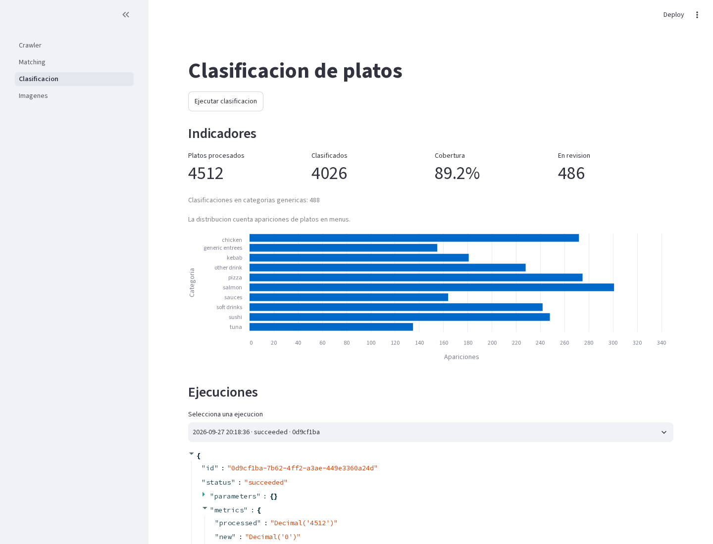

# Food Delivery Data Integration & Analysis

Pipeline local para extraer menús de Just Eat, enlazar restaurantes con Google, clasificar platos, procesar imágenes de cartas y consultar los resultados en un dashboard.

## Requisitos y puesta en marcha

- Docker con Docker Compose.
- GNU Make.
- La carpeta `source/` entregada con la prueba, copiada en la raíz del repositorio.

```sh
git clone https://github.com/Anackor/delectatech-code-test.git
cd delectatech-code-test
make up
make test
```

El entorno levanta dos servicios: `app` (Python 3.12, Chromium, Tesseract y Streamlit) y `db` (PostgreSQL). No es necesario instalar Python ni PostgreSQL en el host.

## Ejecución del pipeline

| Tarea | Comando | Resultado |
| --- | --- | --- |
| Crawler de Just Eat | `make crawl URL=https://www.just-eat.es/restaurants-.../menu` | Restaurante y menú en JSON |
| Matching | `make match PACK_SIZE=50 SEED=42` | Enlace entre locales de Just Eat y Google |
| Clasificación | `make classify` | Platos clasificados con `food_categories.xlsx` |
| POC de imágenes | `make images` | Candidatos extraídos de `google_images.zip` |
| Matching y clasificación | `make pipeline PACK_SIZE=50 SEED=42` | Ejecución consecutiva de las tareas 2 y 3 |

`make classify` requiere una ejecución previa de matching. Cada ejecución queda registrada en PostgreSQL y genera un artefacto JSON inmutable en `output/runs/<execution_id>/`.

Los resultados no se versionan en Git: se reproducen con los comandos anteriores, quedan disponibles en `output/` y se entregan también como un archivo ZIP generado tras el ciclo completo de pruebas.

## Dashboard

```sh
make dashboard
```

Abrir [http://localhost:8501](http://localhost:8501). El dashboard permite ejecutar y revisar por separado crawler, matching, clasificación e imágenes. Matching muestra restaurantes enlazados, cobertura y decisiones ambiguas; clasificación muestra cobertura, revisión y oferta de platos por categoría.

`make images` procesa la muestra de `source/google_images.zip`; la pantalla de imágenes acepta directamente uno o varios archivos JPG, PNG o WebP.





## Enfoque técnico

El proyecto es docker-first y organiza cada tarea por dominio, aplicación y adaptadores. PostgreSQL conserva el estado y el historial; los archivos originales se leen desde `source/` sin modificarlos.

El matching reduce candidatos por proximidad geográfica o código postal. Después aplica reglas ordenadas: teléfono exacto, URL de reparto exacta y una media de similitud de nombre, dirección y distancia cuando esos datos existen. El resultado puede ser `matched`, `ambiguous` o `unmatched` y conserva las puntuaciones utilizadas.

La clasificación usa la taxonomía de `food_categories.xlsx`. Evalúa nombre, sección, cocina, descripción y categorías genéricas mediante reglas reproducibles. Cada plato recibe una categoría con `name`, `parent` y `family`, o queda en estado `review` si no hay evidencia suficiente.

La POC de imágenes ejecuta OCR con Tesseract sobre una muestra pequeña y conserva texto, candidatos, confianza y coordenadas. El enfoque, la evaluación y sus límites están descritos en [docs/IMAGE_POC.md](docs/IMAGE_POC.md).

El uso de herramientas de IA está documentado en [docs/AI_USAGE.md](docs/AI_USAGE.md).

Para detener el entorno:

```sh
make down
```
