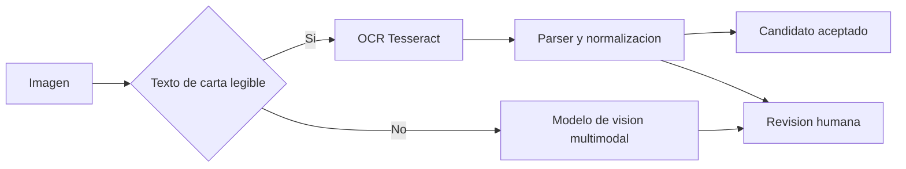

# POC de imagenes

## Alcance reproducible

`make images` lee directamente `source/google_images.zip`; no extrae el archivo al disco. La muestra fija contiene cuatro imagenes de cuatro CID distintos:

| CID | Imagen | Motivo de inclusion | Resultado |
| --- | --- | --- | --- |
| `12353399953336620223` | `a8c3a678c184ef488d25f9774c20128d.jpg` | carta de sushi, texto pequeno | `inconclusive`; candidatos con ruido en revision |
| `1326306244314649407` | `80ada8490cd0992945a911e96597d8e4.jpg` | carta de pizzas legible y multilingue | 8 candidatos aceptados y 4 en revision |
| `9944003937257840785` | `3cbb7ebc3d0c8378482b5a96a94e5278.jpg` | oferta manuscrita | 1 candidato aceptado |
| `13704801545575264378` | `594bd6c734095e01b002c63e7e48614b.jpg` | fotografia exterior sin texto de carta util | `inconclusive` |

La salida completa se escribe en `output/image-candidates.json`. [La muestra versionada](../examples/image-candidates.sample.json) permite revisar su contrato sin distribuir los datos de entrada. La referencia y las metricas de evaluacion estan en [image-evaluation.json](../examples/image-evaluation.json).

## Implementacion

La imagen `app` incorpora Pillow 11.3.0 y Tesseract 5.3.0 con los idiomas `spa` y `eng`. Antes de OCR aplica orientacion EXIF, escala de grises, autocontraste y una reduccion a un maximo de 4 megapixeles. Tesseract tiene un limite de 20 segundos por imagen. El lector rechaza archivos del ZIP de mas de 25 MB y comprueba que la ruta pertenezca al CID declarado.

El adaptador solicita TSV a Tesseract y conserva cada linea, su confianza y sus coordenadas. El parser acepta titulos con dos puntos o titulos cortos en mayusculas; descarta encabezados y precios. Normaliza cada titulo para facilitar una comparacion posterior sin sustituir la evidencia OCR original.

La salida separa `ocrLines`, `candidates` y `reviewCandidates`. Un candidato aceptado debe superar 65 de confianza OCR y no contener fragmentos cortos que indiquen una transcripcion truncada. Los titulos plausibles que no cumplen esos criterios pasan a revision. Esta confianza mide el reconocimiento de caracteres, no que el texto sea un plato.

Cada imagen se procesa de forma independiente. Un archivo corrupto, una imagen demasiado grande o un fallo del proceso genera un resultado `error` para esa imagen y no interrumpe las restantes. Los estados posibles son `candidates`, `no_text_readable`, `inconclusive` y `error`. La ejecucion de referencia tarda 12.2 segundos para las cuatro imagenes en CPU; el comando imprime tambien su duracion total y cada registro conserva la propia.

## Evaluacion manual acotada

Se contrastaron nueve titulos de la carta de pizzas que se leen visualmente con claridad: `Margarita`, `4 quesos Plus`, `Classic Plus`, `Hawaiiana`, `Tex-Mex`, `Pesto con Tomates`, `Boston Caramelizada`, `Honolulu` y `Cabra`.

La ejecucion produjo ocho coincidencias aceptadas correctas, una omision (`Hawaiiana`) y ningun falso positivo aceptado. `HAWwAalana`, `Carbonara`, `Tom & Cheddar` y `esca or` quedaron en revision y no cuentan como platos confirmados. Sobre esta referencia deliberadamente pequena: precision 8/8 (100 %) y recall 8/9 (88.9 %). No es una medicion generalizable: las cartas de sushi y el texto manuscrito muestran errores de transcripcion, y la fotografia exterior queda correctamente sin candidato.

## Uso en produccion

Para fotografias de cartas, se contrastarian los nombres normalizados contra el catalogo de platos del restaurante o la taxonomia. Esta POC no realiza esa vinculacion: no existe una relacion fiable entre cada CID y un menu de Just Eat, y una coincidencia global con la taxonomia generaria categorias incorrectas para titulos como `Margarita`. Para fotografias de comida sin texto, se usaria un modelo de vision multimodal que devuelva etiquetas estructuradas y evidencia; sus resultados no se incorporarian automaticamente al catalogo. Ese enfoque mejora cobertura, pero anade coste por imagen, latencia, dependencia de proveedor y riesgo de etiquetas inventadas. Se deben almacenar version de modelo, puntuacion, evidencia y una cola de revision antes de publicar datos.
